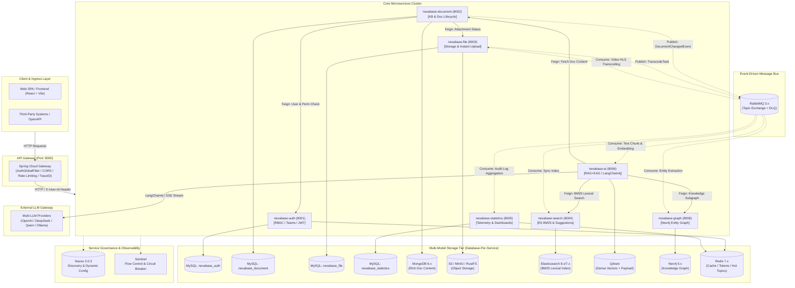

# Nexabase

<div align="center">

**Next-Generation Enterprise Intelligent Knowledge Base System**  
*Driven by RAG (Retrieval-Augmented Generation) + KAG (Knowledge-Augmented Generation) Dual Engines*

[](https://openjdk.org/projects/jdk/21/)
[](https://spring.io/projects/spring-boot)
[](https://spring.io/projects/spring-cloud)
[](https://github.com/alibaba/spring-cloud-alibaba)
[](https://github.com/langchain4j/langchain4j)
[](LICENSE)

[English](README.md) | [简体中文](README.zh-CN.md)

</div>

---

## 📖 Overview

**Nexabase** is an enterprise-grade, distributed intelligent knowledge management platform designed to unleash organizational knowledge assets. Built on top of **Spring Cloud Alibaba** microservices and **Java 21 LTS**, Nexabase addresses critical challenges such as enterprise knowledge silos, implicit knowledge loss during employee turnover, and the data privacy risks associated with public SaaS AI solutions.

By seamlessly uniting **Retrieval-Augmented Generation (RAG)** and **Knowledge-Augmented Generation (KAG)**, Nexabase enables both deep semantic search across massive unstructured documents and logical multi-hop reasoning over structured entity knowledge graphs.

---

## ✨ Key Capabilities & Highlights

### 🧠 1. RAG + KAG Dual-Engine AI Core
- **Semantic RAG**: Vector embedding retrieval powered by **Qdrant** with high-performance payload filtering (RBAC and category isolation), combined with **Elasticsearch BM25** inverted index lexical recall.
- **RRF Re-ranking**: Integrates hybrid retrieval results via the **Reciprocal Rank Fusion (RRF)** algorithm for precise Top-K ranking.
- **Logical KAG**: Entity and relationship extraction orchestrated into **Neo4j** graph database, supporting complex multi-hop graph traversal and causal knowledge discovery.
- **Unified Multi-LLM Gateway**: Built on **LangChain4j 1.9.x**, providing native adapters for OpenAI, DeepSeek, Qwen (DashScope), and local Ollama models with real-time SSE streaming.

### 📚 2. Full-Lifecycle Document & Knowledge Management
- **Hierarchical Category Tree**: Unlimited depth category tree calculated via **Materialized Paths** (`/parentId1/parentId2/selfId/`).
- **Hybrid Storage Architecture**: Structured document metadata and audit logs stored in **MySQL 8.4** (`database-per-service`), while rich unstructured content is persisted in **MongoDB 6.x**.
- **Audit & Versioning**: Complete document version tracking, approval flows, and sensitive keyword filtering.

### 📁 3. Enterprise Multi-Format File Engine
- **Storage Agnostic**: S3-compatible object storage support (**RustFS / MinIO / Aliyun OSS / AWS S3**).
- **Tenant-Isolated Instant Upload (秒传)**: MD5-based duplicate detection to reuse physical storage while maintaining strict tenant data boundaries.
- **Asynchronous Media Processing**: Non-blocking audio/video HLS transcoding and preview generation driven by **RabbitMQ**.

### 🛡️ 4. Enterprise Security & Granular RBAC
- **Gateway-Level Stateless Auth**: Centralized JWT verification at **Spring Cloud Gateway** (`AuthGlobalFilter`) with downstream header propagation (`X-User-Id`, `X-Tenant-Id`), eliminating duplicate JWT parsing across microservices.
- **Fine-Grained Permissions**: Button-level permission enforcement with team/department multi-tenant isolation.
- **Zero-Trust Network Ready**: Strict microservice boundary isolation with OpenFeign client decoupling.

### 📊 5. Observability & Telemetry
- **Distributed Tracing**: Full-link context tracking via MDC `TraceID` across HTTP, OpenFeign, gRPC, and RabbitMQ message headers.
- **Resilience & Protection**: Traffic shaping, rate-limiting, and circuit breaker degradation powered by **Alibaba Sentinel**.
- **Telemetry Dashboards**: Asynchronous consumption of business event logs for knowledge consumption analytics, contributor rankings, and trending search terms.

---

## 🏛️ System Architecture




---

## 🧩 Microservice Modules Breakdown

| Module | Port | Responsibilities | Key Dependencies |
| :--- | :---: | :--- | :--- |
| **`nexabase-foundation`** | - | Common infrastructure: `Result<T>` standard envelope, global exception handler, MDC `traceId`, UserContext, common constants, MyBatis-Plus auto-fill. | Lombok, Hutool, Slf4j |
| **`nexabase-gateway`** | `8000` | Unified API Gateway entry: JWT validation, header forwarding (`X-User-Id`), CORS, reactive rate limiting, and route dispatching. | Spring Cloud Gateway (WebFlux), JJWT |
| **`nexabase-auth`** / `*-api` | `8001` | Authentication & authorization: RBAC (Users, Roles, Permissions, Departments, Teams), token issuance. | MyBatis-Plus, MySQL, Redis, JJWT |
| **`nexabase-document`** / `*-api` | `8002` | Document core: Knowledge base, infinite-tier directory tree (Materialized Path), metadata CRUD, MongoDB content persistence, RabbitMQ event dispatching. | MySQL, MongoDB, RabbitMQ, OpenFeign |
| **`nexabase-file`** / `*-api` | `8003` | File storage engine: S3/MinIO/OSS/RustFS support, MD5 instant upload deduplication, stream download, async media transcoding. | AWS S3 SDK, MySQL, RabbitMQ |
| **`nexabase-search`** | `8004` | Lexical search: Elasticsearch BM25 full-text indexing, query suggestions, keyword highlighting, and search telemetry. | Elasticsearch, RabbitMQ |
| **`nexabase-statistics`** | `8005` | Telemetry & analytics: Async audit log aggregation, user activity ranking, knowledge asset metrics, and trending search terms. | MySQL, Redis, RabbitMQ |
| **`nexabase-ai`** | `8006` | AI Brain & Dual-Engine: LangChain4j integration, Multi-model gateway, Qdrant vector retrieval, Neo4j graph reasoning, RRF hybrid ranking, SSE streaming chat. | LangChain4j, Qdrant, Neo4j, OpenFeign |
| **`nexabase-graph`** | `8008` | Knowledge Graph: Entity and relation schema management, Neo4j multi-hop Cypher queries, graph visualization endpoints. | Neo4j Java Driver, Spring Data Neo4j |

---

## 🛠️ Technology Stack

| Category | Component / Tool | Version | Application in Nexabase |
| :--- | :--- | :--- | :--- |
| **Language** | **Java** | 21 LTS | Virtual threads, Records, Pattern matching, Sealed classes |
| **Core Framework** | **Spring Boot** | 3.5.0 | Underlying application framework across all microservices |
| **Microservice Suite** | **Spring Cloud** | 2025.0.0 | Service routing, load balancing, Feign RPC invocation |
| **Alibaba Ecosystem** | **Spring Cloud Alibaba** | 2025.0.0.0 | Nacos dynamic configuration & discovery, Sentinel flow guard |
| **AI Orchestration** | **LangChain4j** | 1.9.1 | Unified LLM abstraction, Prompt templates, Embedding, and RAG pipelines |
| **Relational DB** | **MySQL** | 8.4.4 / 8.0.x | Structured relational business entities (`database-per-service`) |
| **Document DB** | **MongoDB** | 6.x | High-throughput storage for unstructured long-form document markdown |
| **Vector DB** | **Qdrant** | v1.7.4+ | Dense vector indexing with native payload filtering for RBAC constraints |
| **Graph DB** | **Neo4j** | 5.x | KAG core: entity relation graph storage and multi-hop inference |
| **Search Engine** | **Elasticsearch** | 8.x / 7.17.x | BM25 lexical inverted index recall and aggregations |
| **Cache & Session** | **Redis** | 7.x | High-performance cache, token blacklists, search hotlists |
| **Message Queue** | **RabbitMQ** | 3.13.x | Async event bus for vectorization, indexing, transcoding & audit logs |
| **ORM & DB Tools** | **MyBatis-Plus** | 3.5.17 | Database ORM, code generation, audit field auto-filling |
| **API Docs** | **Knife4j / OpenAPI** | 4.5.0 / 2.8.9 | Automated Swagger OpenAPI 3 interactive documentation |

---

## 📂 Repository Structure

```text
nexabase/
├── nexabase-foundation/          # Common base module (Result, Exceptions, MDC TraceID, Utils)
├── nexabase-gateway/             # Spring Cloud Gateway (8000)
├── nexabase-auth/                # Authentication & RBAC Service (8001)
│   └── ...
├── nexabase-auth-api/            # Auth Feign Client & DTO contracts
├── nexabase-document/            # Document & Knowledge Base Management (8002)
├── nexabase-document-api/        # Document Feign Client & DTO contracts
├── nexabase-file/                # File Engine & Object Storage (8003)
├── nexabase-file-api/            # File Feign Client & DTO contracts
├── nexabase-search/              # Elasticsearch BM25 Search Service (8004)
├── nexabase-statistics/          # Analytics & Telemetry Service (8005)
├── nexabase-ai/                  # RAG + KAG AI Dual-Engine & LLM Gateway (8006)
├── nexabase-graph/               # Neo4j Knowledge Graph Service (8008)
├── docker/                       # Docker & Middleware configurations
├── docs/                         # Architecture, design specs & API guides
├── pom.xml                       # Root Maven multi-module dependency management
├── README.md                     # English documentation (Default)
└── README.zh-CN.md               # Simplified Chinese documentation
```

---

## 🚀 Quick Start Guide

### Prerequisites
- **JDK**: Java 21 LTS (e.g., Eclipse Temurin 21 or Oracle JDK 21)
- **Build Tool**: Apache Maven 3.9+ (or use the included `./mvnw`)
- **Container Runtime**: Docker & Docker Compose

### 1. Launch Middleware Stack
You can start all required middleware containers via Docker Compose:

```bash
# Recommended: Start middleware via docker-compose
docker compose -f docker/nacos/docker-compose.yml up -d
# Ensure MySQL (8.4), Redis (7.x), MongoDB (6.x), RabbitMQ (3.x), Neo4j (5.x), Qdrant and ES are running
```

### 2. Configure Dynamic Properties in Nacos
Nexabase strictly adopts modern Spring Boot configuration import (`spring.config.import: optional:nacos:...`). Local `application.yml` files only contain minimal service identifiers and Nacos addresses.

1. Access Nacos Console: `http://localhost:8848/nacos` (Default: `nacos` / `nacos`).
2. Import common configuration `nexabase-common.yml` under the default `DEFAULT_GROUP` or dev namespace.
3. Configure target database credentials, LLM API keys (`DASHSCOPE_API_KEY`, `OPENAI_API_KEY`, etc.), and storage buckets.

### 3. Build Project
Compile and package all microservices:

```bash
# Unix / macOS
./mvnw clean package -DskipTests

# Windows PowerShell
.\mvnw.cmd clean package -DskipTests
```

### 4. Run Microservices
Start the services in the following recommended order:

1. **`nexabase-gateway`** (Port: `8000`)
2. **`nexabase-auth`** (Port: `8001`)
3. **`nexabase-file`** (Port: `8003`)
4. **`nexabase-document`** (Port: `8002`)
5. **`nexabase-search`** (Port: `8004`)
6. **`nexabase-graph`** (Port: `8008`)
7. **`nexabase-ai`** (Port: `8006`)
8. **`nexabase-statistics`** (Port: `8005`)

---

## 📡 API Documentation & Exploration

All microservices are equipped with Knife4j OpenAPI 3 interactive documentation.

- **Gateway Aggregated Docs**: `http://localhost:8000/doc.html`
- **Auth Service Docs**: `http://localhost:8001/doc.html`
- **Document Service Docs**: `http://localhost:8002/doc.html`
- **File Service Docs**: `http://localhost:8003/doc.html`
- **AI Service Docs**: `http://localhost:8006/doc.html`

---

## 🗺️ Roadmap & Milestones

- [x] **Stage 1 (Foundation & Content Hub)**:
  - High-performance object storage integration with MD5 deduplication and instant uploads.
  - Unlimited materialized-path directory tree and dual MySQL + MongoDB persistence.
  - RabbitMQ event-driven asynchronous architecture.
- [x] **Stage 2 (Search & AI Dual Engine)**:
  - Elasticsearch BM25 full-text indexing & search suggestions.
  - Qdrant dense vector semantic search with payload isolation.
  - Neo4j graph entity/relation extraction and multi-hop reasoning.
  - RRF hybrid multi-channel recall & re-ranking.
  - LangChain4j multi-LLM integration and streaming SSE dialogues.
- [ ] **Stage 3 (Advanced Governance & Collaboration)**:
  - Real-time collaborative document editing (OT / CRDT).
  - Multi-tenant fine-grained data-level permission rules engine.
  - Automated enterprise knowledge evaluation benchmark.

---

## 🤝 Contributing

Contributions are welcome! Please feel free to submit issues, file feature requests, or send pull requests:

1. Fork the repository (`git checkout -b feature/AmazingFeature`).
2. Commit your changes with clear, descriptive commit messages.
3. Push to the branch (`git push origin feature/AmazingFeature`).
4. Open a Pull Request.

---

## 📄 License

This project is licensed under the Apache 2.0 License - see the [LICENSE](LICENSE) file for details.
