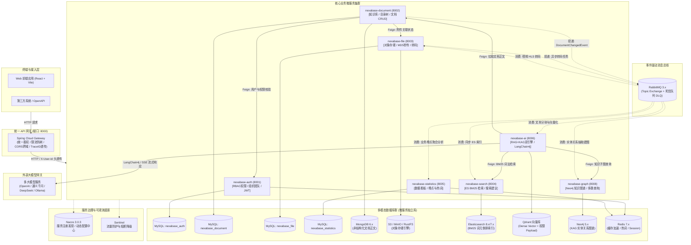

# Nexabase

<div align="center">

**企业级智能知识库系统**  
*基于 RAG（检索增强生成）与 KAG（知识增强生成）双引擎驱动*

[](https://openjdk.org/projects/jdk/21/)
[](https://spring.io/projects/spring-boot)
[](https://spring.io/projects/spring-cloud)
[](https://github.com/alibaba/spring-cloud-alibaba)
[](https://github.com/langchain4j/langchain4j)
[](LICENSE)

[English](README.md) | [简体中文](README.zh-CN.md)

</div>

---

## 📖 项目简介

**Nexabase** 是一套面向企业数字化转型的分布式智能知识库管理平台，秉承“**让企业里的知识真正流动起来**”的产品愿景。系统采用 **Spring Cloud Alibaba** 微服务体系与 **Java 21 LTS** 架构构建，旨在解决企业内部“知识孤岛分散、隐性经验流失、检索定位困难、SaaS AI 数据合规与隐私泄露”等核心痛点。

Nexabase 创新性地融合了 **RAG (检索增强生成)** 与 **KAG (知识增强生成)** 双引擎体系，既支持对海量非结构化文档的深度语义搜索，又支持基于实体关系知识图谱的复杂多跳逻辑推理，为企业提供真正安全可控、高精度、高可用的智能知识中枢。

---

## ✨ 核心特性与亮点

### 🧠 1. RAG + KAG 双引擎 AI 问答体系
- **语义 RAG 检索**：基于 **Qdrant** 高性能向量数据库，原生支持 **Payload Filtering（负载过滤）**，无缝实现基于 RBAC 权限和分类标签的向量空间隔离；结合 **Elasticsearch BM25** 关键词倒排索引召回。
- **RRF 混合加权排序**：采用 **RRF (Reciprocal Rank Fusion)** 倒数排名融合算法，对语义路与词法路进行智能加权重排，显著提升 Top-K 结果命中精准率。
- **逻辑 KAG 推理**：基于 **Neo4j** 图数据库构建企业知识图谱，通过大模型抽取实体与关系，支持多跳（Multi-Hop）图谱遍历与深层因果关系推理。
- **统一多大模型网关**：基于 **LangChain4j 1.9.x** 封装，支持 OpenAI、DeepSeek、阿里通义千问 (Qwen)、本地私有化 Ollama 等多模型无缝热切换与流式 SSE 输出。

### 📚 2. 文档全生命周期与混合存储
- **无限层级目录树**：采用**物化路径 (Materialized Path)** 算法（`/parentId1/parentId2/selfId/`），秒级获取全量目录层级拓扑与依赖关系。
- **混合持久化架构**：结构化元数据、权限及审计日志存储于 **MySQL 8.4**（`database-per-service` 隔离），长篇富文本与 Markdown 正文存储于 **MongoDB 6.x**。
- **版本控制与安全合规**：支持文档版本追溯、敏感词过滤与审批流转机制。

### 📁 3. 企业级多格式文件引擎
- **全格式对象存储**：适配 S3 兼容协议，无缝接入 **RustFS / MinIO / 阿里云 OSS / AWS S3**。
- **租户隔离级秒传**：基于 MD5 哈希校验，同租户内复用物理存储块，跨租户物理隔离。
- **异步媒体处理**：基于 **RabbitMQ** 实现大文件异步切片、音视频 HLS 转码及缩略图/预览图生成，保障主干业务低延迟。

### 🛡️ 4. 企业级安全与细粒度 RBAC
- **网关统一无状态鉴权**：在 **Spring Cloud Gateway** (`AuthGlobalFilter`) 统一完成 JWT 校验与安全拦截，通过 HTTP Header (`X-User-Id`, `X-Tenant-Id`) 向下游微服务透传，避免下游重复解析。
- **细粒度权限控制**：精确到按钮级与数据级的权限隔离，支持多部门、团队权限继承。
- **接口防腐与隔离**：微服务间通过独立的 `*-api` 模块抽取 Feign Client 与 DTO 模型，避免服务间紧耦合。

### 📊 5. 全链路可观测性与数据分析
- **全链路追踪 (TraceID)**：基于 MDC 实现日志链路打标，全链路透传至 HTTP Header、OpenFeign、gRPC 及 RabbitMQ 消息头。
- **高可用与熔断限流**：集成 **Alibaba Sentinel**，实现关键链路的自适应流控与降级兜底（Fallback）。
- **知识热度与运营看板**：异步采集用户行为埋点，实时分析热门搜索词、知识消费趋势与贡献活跃度排行。

---

## 🏛️ 系统架构图




---

## 🧩 微服务模块与职责划分

| 模块名称 | 运行端口 | 核心职责 | 核心技术栈 / 依赖 |
| :--- | :---: | :--- | :--- |
| **`nexabase-foundation`** | - | 基础通用公共底座：`Result<T>` 统一响应封装、全局异常处理体系、MDC TraceID 全链路日志追踪、UserContext 上下文、公共工具库。 | Lombok, Hutool, Slf4j |
| **`nexabase-gateway`** | `8000` | 统一微服务网关入口：全局 JWT 解析校验、`X-User-Id` 请求头透传、CORS 跨域处理、响应式路由分发与限流拦截。 | Spring Cloud Gateway (WebFlux), JJWT |
| **`nexabase-auth`** / `*-api` | `8001` | 统一认证与权限中心：基于 RBAC 的用户、角色、权限、组织架构、部门及团队管理，Token 签发与刷新。 | MyBatis-Plus, MySQL, Redis, JJWT |
| **`nexabase-document`** / `*-api` | `8002` | 文档核心业务：知识库 CRUD、基于物化路径的无限级目录树、MySQL 元数据管理、MongoDB 正文存储、RabbitMQ 变更事件广播。 | MySQL, MongoDB, RabbitMQ, OpenFeign |
| **`nexabase-file`** / `*-api` | `8003` | 文件与对象存储服务：支持 S3/MinIO/OSS/RustFS 适配、MD5 租户级文件秒传、文件流式下载、MQ 驱动的视频转码任务。 | AWS S3 SDK, MySQL, RabbitMQ |
| **`nexabase-search`** | `8004` | 检索服务：Elasticsearch BM25 全文检索、搜索补全建议、高亮展示、热词排行统计。 | Elasticsearch, RabbitMQ |
| **`nexabase-statistics`** | `8005` | 业务统计与分析：异步日志埋点采集消费、知识消费与沉淀趋势分析、用户贡献排行榜、热点知识分布。 | MySQL, Redis, RabbitMQ |
| **`nexabase-ai`** | `8006` | AI 大脑与双引擎：LangChain4j 多模型统管、Qdrant 语义向量召回、Neo4j 知识图谱增强、RRF 混合重排、SSE 流式智能对话。 | LangChain4j, Qdrant, Neo4j, OpenFeign |
| **`nexabase-graph`** | `8008` | 知识图谱服务：实体与关系抽取、Neo4j Cypher 多跳图遍历查询、图谱可视化接口。 | Neo4j Java Driver, Spring Data Neo4j |

---

## 🛠️ 技术选型矩阵

| 分类 | 技术组件 | 版本 | 在 Nexabase 中的实际用途 |
| :--- | :--- | :--- | :--- |
| **开发语言** | **Java** | 21 LTS | 虚拟线程 (Virtual Threads)、Record 类、模式匹配、高吞吐并发能力 |
| **核心底座** | **Spring Boot** | 3.5.0 | 所有微服务的基础启动与依赖注入框架 |
| **微服务体系** | **Spring Cloud** | 2025.0.0 | 微服务治理、负载均衡、声明式服务调用 (OpenFeign) |
| **微服务组件** | **Spring Cloud Alibaba** | 2025.0.0.0 | Nacos 动态服务注册与配置中心集成、Sentinel 容错流控 |
| **AI 编排框架** | **LangChain4j** | 1.9.1 | 大模型统一抽象、Prompt 模板、Embedding 计算及 RAG 流程收口 |
| **关系型数据库** | **MySQL** | 8.4.4 / 8.0.x | 结构化业务数据持久化，严格遵循 `database-per-service` 独立库原则 |
| **文档型数据库** | **MongoDB** | 6.x | 存储长篇富文本及非结构化 Markdown 文档正文内容 |
| **向量数据库** | **Qdrant** | v1.7.4+ | 核心语义向量检索，原生支持强悍的 Payload Filtering 权限过滤 |
| **图数据库** | **Neo4j** | 5.x | KAG 引擎核心：存储实体、知识节点及关联关系，支撑多跳逻辑推理 |
| **搜索引擎** | **Elasticsearch** | 8.x / 7.17.x | 文档全文检索与词元倒排索引 (BM25 路召回) |
| **高速缓存** | **Redis** | 7.x | 缓存加速、Session 存储、Token 黑名单、实时热词排行 |
| **消息队列** | **RabbitMQ** | 3.13.x | 异步事件总线：文档同步、向量化、图谱构建、转码及审计日志处理 |
| **持久层框架** | **MyBatis-Plus** | 3.5.17 | ORM 映射、条件构造器、审计字段自动填充 (`createdAt`/`updatedAt`) |
| **接口文档** | **Knife4j / OpenAPI** | 4.5.0 / 2.8.9 | 基于 Swagger/OpenAPI 3 规范的交互式接口文档 |

---

## 📂 工程目录结构

```text
nexabase/
├── nexabase-foundation/          # 基础公共模块（Result统一封装、异常体系、MDC追踪、公共工具）
├── nexabase-gateway/             # API 网关层（端口 8000，JWT校验与路由分发）
├── nexabase-auth/                # 认证与权限微服务（端口 8001，RBAC/团队管理）
├── nexabase-auth-api/            # Auth 接口声明与 DTO 数据模型
├── nexabase-document/            # 文档与知识库微服务（端口 8002，物化路径目录树/正文管理）
├── nexabase-document-api/        # Document 接口声明与 DTO 数据模型
├── nexabase-file/                # 文件管理微服务（端口 8003，S3存储/MD5秒传/视频转码）
├── nexabase-file-api/            # File 接口声明与 DTO 数据模型
├── nexabase-search/              # 检索微服务（端口 8004，ES BM25 全文检索）
├── nexabase-statistics/          # 数据统计微服务（端口 8005，数据看板与埋点聚合）
├── nexabase-ai/                  # AI 核心服务（端口 8006，RAG/KAG双引擎、LangChain4j）
├── nexabase-graph/               # 知识图谱服务（端口 8008，Neo4j 实体关系与多跳查询）
├── docker/                       # Docker 及各中间件部署编排配置
├── docs/                         # 详细系统架构、模块设计、数据库与部署文档
├── pom.xml                       # Maven 根工程依赖与版本管理
├── README.md                     # 英文入口文档（默认）
└── README.zh-CN.md               # 简体中文入口文档
```

---

## 🚀 快速启动指南

### 前置环境准备
- **JDK**：Java 21 LTS（推荐 Eclipse Temurin 21 或 Oracle JDK 21）
- **构建工具**：Apache Maven 3.9+（或使用自带的 `./mvnw`）
- **容器环境**：Docker & Docker Compose

### 1. 启动中间件基础设施
项目推荐使用 Docker Compose 进行容器化部署各中间件服务：

```bash
# 启动 Nacos 服务注册与配置中心
docker compose -f docker/nacos/docker-compose.yml up -d

# 确保 MySQL (8.4)、Redis (7.x)、MongoDB (6.x)、RabbitMQ (3.x)、Neo4j (5.x)、Qdrant 及 ES 均已正常运行
```

### 2. Nacos 动态配置注入
Nexabase 彻底弃用了过时的 `bootstrap.yml`，统一采用 Spring Boot 标准的 `spring.config.import: optional:nacos:...` 语法。本地 `application.yml` 仅保留服务名与 Nacos 地址。

1. 登录 Nacos 管理控制台：`http://localhost:8848/nacos`（默认账号/密码：`nacos` / `nacos`）。
2. 在 `DEFAULT_GROUP` 中导入全局公共配置 `nexabase-common.yml`。
3. 按需配置数据库连接池密码、LLM API Key（如 `DASHSCOPE_API_KEY`、`OPENAI_API_KEY`）及对象存储凭据。

### 3. 项目编译与打包
在项目根目录下执行 Maven 打包命令：

```bash
# Linux / macOS
./mvnw clean package -DskipTests

# Windows PowerShell
.\mvnw.cmd clean package -DskipTests
```

### 4. 启动微服务集群
推荐按照如下依赖顺序依次启动各微服务：

1. **`nexabase-gateway`**（端口：`8000`）
2. **`nexabase-auth`**（端口：`8001`）
3. **`nexabase-file`**（端口：`8003`）
4. **`nexabase-document`**（端口：`8002`）
5. **`nexabase-search`**（端口：`8004`）
6. **`nexabase-graph`**（端口：`8008`）
7. **`nexabase-ai`**（端口：`8006`）
8. **`nexabase-statistics`**（端口：`8005`）

---

## 📡 接口文档与调试 (Knife4j)

所有微服务均已集成 Knife4j OpenAPI 3 交互式接口文档：

- **网关聚合文档入口**：`http://localhost:8000/doc.html`
- **认证服务接口**：`http://localhost:8001/doc.html`
- **文档服务接口**：`http://localhost:8002/doc.html`
- **文件服务接口**：`http://localhost:8003/doc.html`
- **AI 引擎接口**：`http://localhost:8006/doc.html`

---

## 🗺️ 研发路线图 (Roadmap)

- [x] **第一阶段 (基础资产与内容管理体系)**：
  - 高性能对象存储接入、MD5 租户级文件秒传。
  - 基于物化路径的无限级目录树拓扑、MySQL 元数据 + MongoDB 正文混合存储。
  - RabbitMQ 异步事件驱动架构。
- [x] **第二阶段 (智能检索与 AI 双引擎)**：
  - Elasticsearch BM25 全文检索与搜索建议。
  - Qdrant 向量空间隔离与深度语义检索。
  - Neo4j 知识图谱实体关系抽取与多跳遍历推理。
  - RRF 多路召回融合加权重排算法。
  - LangChain4j 多模型网关与 SSE 流式问答。
- [ ] **第三阶段 (高阶协同与智能治理)**：
  - 多人实时协同富文本编辑 (基于 OT / CRDT)。
  - 动态规则引擎驱动的数据级细粒度隔离。
  - 企业知识库自动化评测评估基准 (Evaluation Benchmark)。

---

## 🤝 贡献指南 (Contributing)

欢迎提交 Issue 和 Pull Request 来完善 Nexabase！

1. Fork 本仓库 (`git checkout -b feature/AmazingFeature`)。
2. 遵循已有代码规范提交代码，确保编写清晰的 Commit Message。
3. 推送至您的分支 (`git push origin feature/AmazingFeature`)。
4. 创建 Pull Request 并描述您的改进。

---

## 📄 开源协议 (License)

本项目采用 Apache 2.0 开源许可证，详情请参阅 [LICENSE](LICENSE) 文件。
